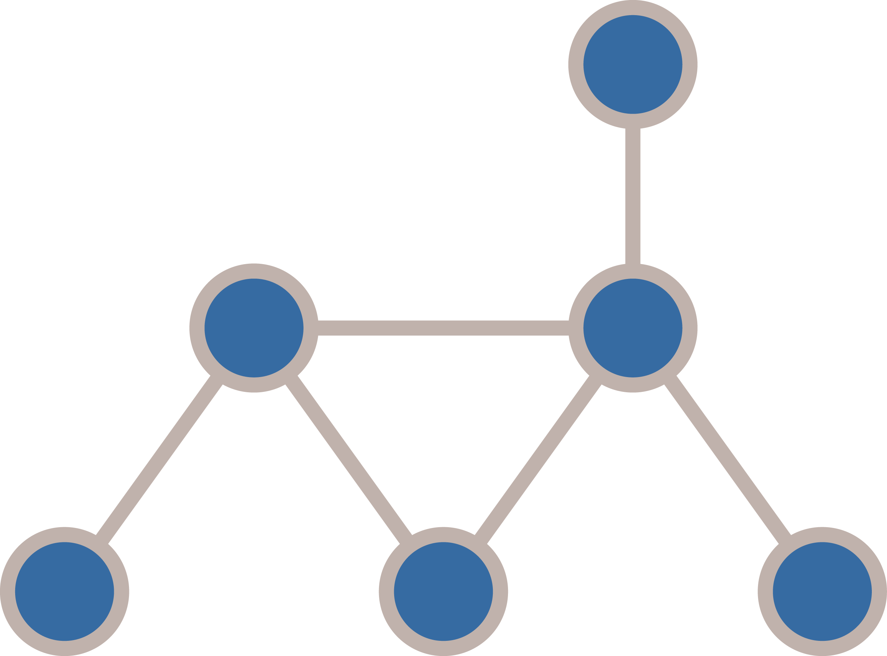
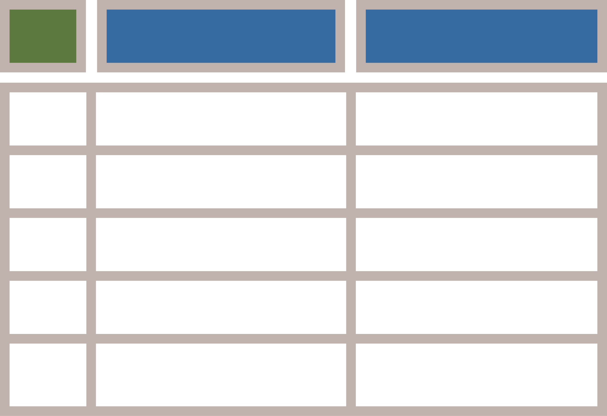
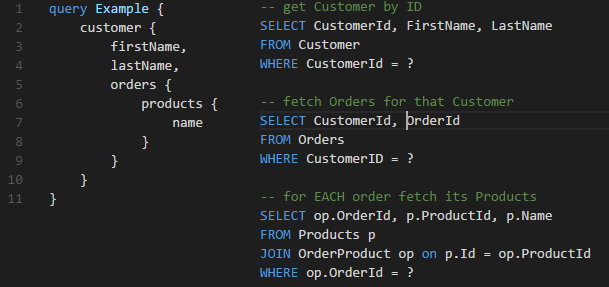
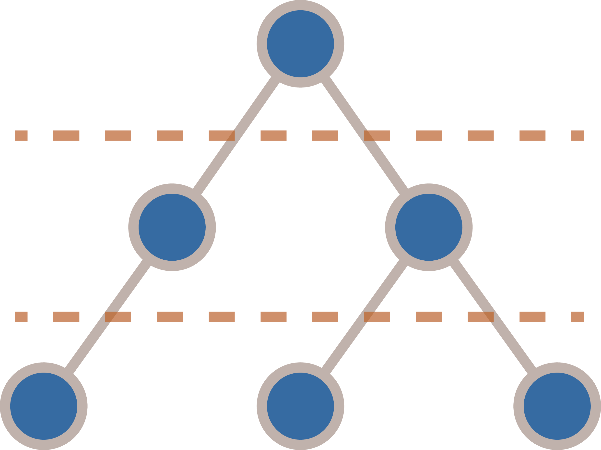
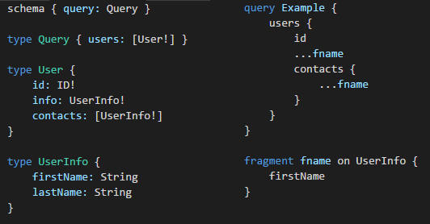
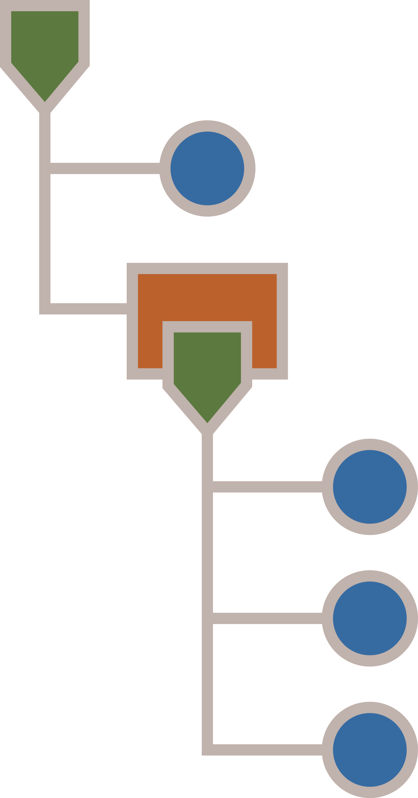

- title : GraphQL
- description : Facebook's application-level query language
- author : Bartosz Sypytkowski (@horusiath)
- theme : night
- transition : default

***

# GraphQL

Rest API 2.0?

***

## Agenda

- REST API: any problems?
- What is GraphQL?
    - Specification
    - Tooling
- What is FSharp.Data.GraphQL?
    - Demo
- Lessons learned 
- Post mortem: RelayJS 

***
## RESTful API

Common problems:

- What is REST? (baby don't hurt me)
- Tied to HTTP request-response model
- Over- and underfetching

---
## "Rules" of REST

What if someone doesn't give a shit?

' There are not direct rules, that will make your services REST-incompatible if you violate them.
' You need to hope, that your API producer understands REST principles the same way you do.

---

## Tied to HTTP request/response

Which HTTP verb will you use for create request over web sockets? XD

' REST is inherently tied to HTTP (req/rep in particular). Need some other medium? Sucks to be you.

---
## Over- and underfetching

When you need a little more or a little less.

' What when API you get doesn't provide all data under single route call?
' What when the only usefull route call provides way more data than you need?
' Under- and overfetching may lead to an API blowup, where every user action has a separate request/response cycle.

***
## What is GraphQL?
Standard for application-level query language invented by Facebook.

---
## It's cross-platform

- FSharp.Data.GraphQL (*F#*)
- graphql-js (*JavaScript*)
- graphql-ruby (*Ruby*)
- graphql-php (*PHP*)
- graphql-go (*Go*)
- graphql-net, graphql-dotnet (*C#*)
- graphql-java (*Java*)
- graphene (*Python*)
- Sangria (*Scala*)
- absinthe (*Elixir*)
- PostGraphQL (*PostgreSQL*)
- graphql-lua (*Lua*)
- graphql-haskell (*Haskell*)
- graphql-clj (*Clojure*)

---
## What does it look like?

|------|---------|
|  |  |

' Language is based on JSON.

---
## It's statically typed

Schema notation:

    [lang=graphql]
    schema {
        query: Query
    }

    type Query {
        people(take: Int): [Person]!
    }

    interface Character {
        id: String!
        name: String!
    }

    type Person implements Character {
        id: String!
        name: String!
        friends: [Character]!
    }

' Having schema language is great when it comes to talk with people with different backgrounds.
' As GraphQL is not platform specyfic, Python/Ruby/.NET/JVM people can easy talk about same thing.

---
## Type system

- Scalars
- Enums
- Objects
- Interfaces
- Unions
- InputObjects
- Lists / NonNulls

Directives:

- @skip
- @include
- and more...

' Since it's cross-platform it needs type system, that can be implemented on all platforms.

---
## Introspection

Ability to retrieve an information about your schema by using GraphQL itself.

    [lang=graphql]
    query GetTypes {
        __schema {
            types {
                name
                fields {
                    name
                    type {
                        name
                    }
                }
            }
        }
    }

(Excelent for tooling)

' Once you can meta-query your schema, you can use GraphQL itself to ask GraphQL server about all of its capabilities.
' No need for separate standards, it's all self contained.

***
## FSharp.Data.GraphQL

F# implementation of GraphQL standard for client and server.

    open FSharp.Data.GraphQL.Types
    
    let rec Person = Define.Object("Person", fun () -> [
        Define.Field("name", String, fun _ p -> p.FirstName + " " + p.LastName)
        Define.Field("friends", ListOf Person, fun _ p -> p.Friends)
        Define.AsyncField("pic", Url, fun _ p -> asyncGetAvatar p.Id)
    ])

    let Query = Define.Object("Query", [
        Define.Field("people", ListOf Person, "", [ Define.Input("take", Int) ], 
            fun ctx db -> db.People |> Seq.take (ctx.Arg "take"))
    ])

    let schema = Schema(Query)

' Don't go into details.

---
## It's like a language

1. Compilation
2. Planning
3. Execution

' Compilation - once schema is being created, your server capabilities have been set. Try to prepare as much as possible at this point.
' Planning - first time an unique query comes in. Now you know what's needed - all fields etc. From here only dynamic parts are variables.
' Execution - when all data has been proided and we can execute query and produce results.

***
## It all comes with a cost...

- Development speed **over** machine speed
- Joins **over** aggregations
- Dynamic queries **can lead to** N+1 SELECTs
- **Big** responses

' It's made for pleasant frontend experience. Don't expect performance equal to actions with custom-tailored database queries.
' GraphQL excels at joins, but has no notion for aggregations.
' Since required fields are known only at runtime, it's hard to create code where you prefetch all required data in a single database call.
' Since we don't make X server requests, a single response can get quite big - i.e. Facebook's Introspection result is a 70-200MB JSON in size. 

---
## Joins vs aggregations

| Good | Bad |
|------|------|
|  |  |

' If you need aggregated data, OData may be better fit here.

---
## N+1 SELECT problem in GraphQL

|----|----|
|  |  |

' How to predict which tables to prefetch when required fields can change with every query.
' NOTE: good part - since all programming is pretty generic, once you fix one problem, you fix it everywhere, it occurs. 

---
## Batched responses can get quite big

- How to chunk big responses?
- How to block oversized queries?

' It would be good to send the most importand data immediatelly, and then fetch the "less" importand details in the background.
' What if user will ask for half of the database - we need to be able to block mallicious queries.

***
## Discoveries down the road

What approaches did we use to address problems we've met?

---
## AsyncVal

Uniform API to work with both sync/async computations:

    [lang=fsharp]
    // works well with Async computations...
    asyncVal {
        return! Http.AsyncRequestString("http://some-domain.co")
    } |> AsyncVal.get

    // ... while this is still pretty fast
    asyncVal { return 1 } |> AsyncVal.get

Fast, low overhead in synchronous cases:

- **~3000 times faster** than async.Return
- **No extra heap allocations!**

' It's similar to `ValueTask<>` proposal for .NET core TPL

---
## Execution plan
Know what's going to be executed before executing it.

' Execution plan merged server side informations (field types, how to resolve data from them) 
' with a client side query AST. It also inlines requested fragments. Therefore it provides a 
' ready description of what and how should be resolved during query execution before starting
' execution phase itself.

---
## Property tracker
Know what's going to be accessed before accessing it.

*Execution plan infers usage of objects and fields defined GraphQL schema*

*Property tracker infers usage of .NET objects and properties directly from the code before it executes* 

' When trying to "marry" GraphQL with SQL backend, we noticed, that sometimes our domain model (expressed
' in GraphQL schema) doesn't match SQL-schema. In that case execution plan is not enough. We needed some
' way of informing ORMs which tables to prefetch, even when requested properties where not described as
' GraphQL fields.
' Property tracker extends execution plan to dynamic code analysis in order to get a tree of .NET properties
' that is accessed by the executed code (as far as possible).

---
## Future plans

- Partial responses ([@defer](https://github.com/bazingatechnologies/FSharp.Data.GraphQL/issues/93) directive)
- Subscriptions
- Query complexity analysis
- IL code emitter

(Keep track of improvements on [github](https://github.com/bazingatechnologies/FSharp.Data.GraphQL/issues))

' Use `AsyncSeq<>` to return partially available data - so that "important" stuff is sent right away, and rest is send later.
' Support for pub/sub pattern - not yet part of GraphQL standard, but done as experimental in many implementations.
' Analyse query complexity before executing it in order to avoid server overrun.

***
## End

References:

- GraphQL quickstart: http://graphql.org/learn/
- Project site: http://bazingatechnologies.github.io/FSharp.Data.GraphQL/
- Apollo stack: http://www.apollostack.com/
- RelayJS - client-side data layer: https://facebook.github.io/relay/